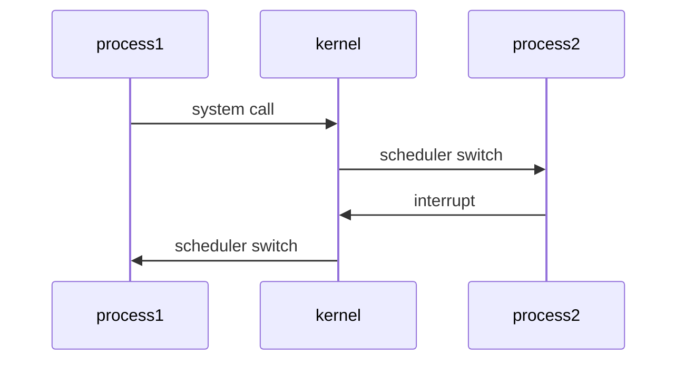
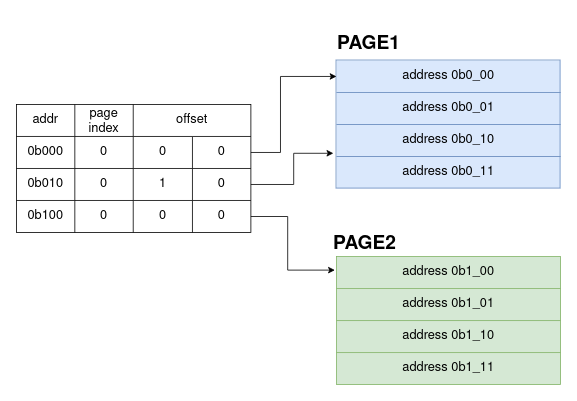
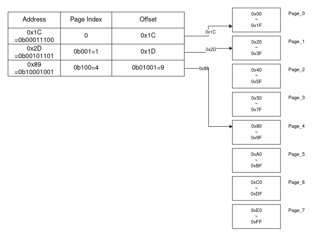
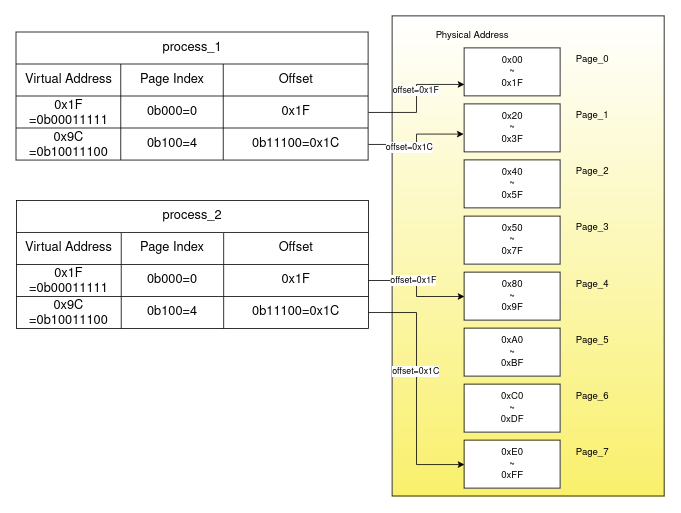
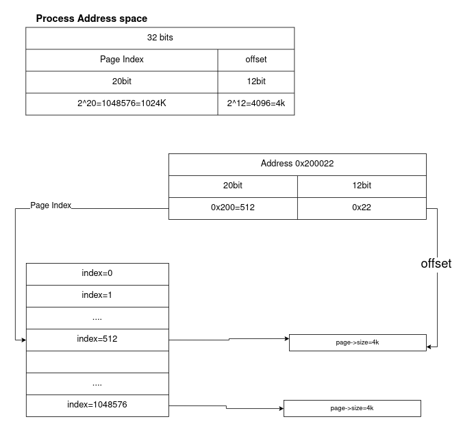

# BorderOs
a toy level unix like kernel writtern for raspberry pi 3
I build it just for exploring and understanding some key point in kernel developement
## Big picture behind kernel
before we dive into kernal dev, big picture must established in our mind.
1. cpu can only execute one process's code at one time
2. intterupt happened indepently 
3. we can use interrupt to jump into kernel code 
4. in kernel code we can call scheduler , allocate memory for new process, deallocate memory for killed process .......  
5. cpu execute process for a short time, when interrupt happpened , start execute kernel ,do some management, and then execute process code again.  
in below diagram  
#### processx: mean cpu excute process_x's code  currently!  
#### kernel:mean cpu excute kernel's code currently!  

the kernel code in charge of all cpu resource management.

## page -> a new way to orgnize our  address
the core concet of virtual address is page.  
#### but page is just a range of memory
assume a tiny tiny memory which size is 8 byte.
a 3 bit number can address all the space. because $2^3=8$  
we can divide it into 2 pages($2^1=2$). each page is 4 byte. ($2^2=4$)  
memory still the same memory but we change a view of it.by using page.

now consider a more wide range of memory which size is $2^8=256$ bytes (0x00~0xFF), definitly a 8 bit number can address all the space in this memory. we want to design the new page size is $2^5=32$ byte. page number for such memory range is $2^3=8$ , ($3=8-5$, $8*32=256$).

from now we found basic page system provide another way for us to orgnize our memory. it's elegant , it is an art.

## virtual address is created for process
we compile 2 process. each process will plan to read some data from memory 0x1F and 0x9C.(0x1F and 0x9C is already a virtual address, because compiler don't know the current status of OS/PC,they can only assign to a fixed memory) but how could we allow them to access the same memory? wow , we know page system is elegant. but if see each page is a indepedent world. we can assign differrent page to to different process's same virtual memory.

## Draw back of simple page table.
A 1 level page table is easy to understand.
In real world a typical address range is 32 bit. and page size is 4k(2^12=4K) which means we can index 2^20 pages(20=32-12). if we manage process's page table(we need memory to store them right?),we need consume huge memory in our kernel

